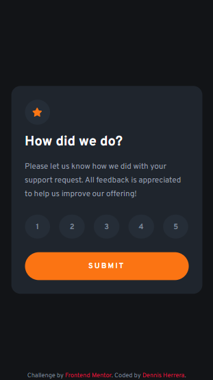
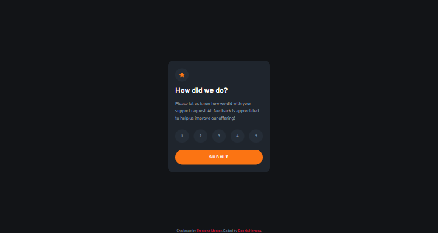

# Frontend Mentor - Interactive rating component solution

This is a solution to the [Interactive rating component challenge on Frontend Mentor](https://www.frontendmentor.io/challenges/interactive-rating-component-koxpeBUmI). Frontend Mentor challenges help you improve your coding skills by building realistic projects. 

## Table of contents

- [Overview](#overview)
  - [Screenshot](#screenshot)
  - [Links](#links)
- [My process](#my-process)
  - [Built with](#built-with)
  - [What I learned](#what-i-learned)
  - [Continued development](#continued-development)
  - [Useful resources](#useful-resources)
- [Author](#author)
- [Acknowledgments](#acknowledgments)

## Overview

### Screenshot




### Links

- [Live site](https://klonnister.github.io/rating-component/)

## My process

### Built with

- Semantic HTML5 markup
- CSS custom properties
- Flexbox
- CSS Grid
- Mobile-first workflow
- Javascript

### What I learned

This was my first time using javascript so it was kind of hard. I learned that I can
use an id as a parameter and specify it in the html element event. Like this:

```html
<button 
  type="button"
  id="star1"
  onclick="afterClick('star1')" 
  class="button hover"
>
1
</button>
```

I read a little bit about how to use the focus-visible pseudo class. It only has effect 
when the element gets focused with the tabulator key.

```css
#ratingS .numbers-container > .hover:focus-visible { 
  background-color: var(--medium-gray);
  color: var(--white);  
}
```

I learned how to use the querySelectorAll() method in javascript and querySelector(). (querySelectorAll will return a NodeList and you can use some array methods to access its
components).

```js
const buttons = document.querySelectorAll(".button");
```

I also practiced using the forEach() method in javascript. (Always use a variable name to refer
to every array component used in the function, in this case we used 'button')

```js
buttons.forEach((button) => {
    button.addEventListener("mousedown", function() {
      button.classList.add("down");
      button.classList.remove("hover");
    })
    button.addEventListener("mouseup", function() {
      button.classList.remove("down");
    })
});
```

Lastly, I used an if statement and practiced using Logical operators (&& || !)

```js
if (ratingNumber.innerText != "" && ratingNumber.innerText != null) {
    thanksS.style.display = "flex";
    ratingS.style.display = "none";
  } else {
    alert("Please select a number.")
  }
```

### Useful resources

- [Mozilla web docs focus-visible](https://developer.mozilla.org/en-US/docs/Web/CSS/:focus-visible) - You can read more about the focus-visible pseudo class in this page.
- [Katrin Pedersen solution](https://www.frontendmentor.io/solutions/interactive-rating-component-using-html-css-and-javascript-_lTPLZYplO) - I took this solution
as a base to make mine. Not sure if he/she will see this but their solution looks very good
and was pretty creative.

## Author

- Frontend Mentor - [Klonnister](https://www.frontendmentor.io/profile/Klonnister)
- Instagram - [dennis_herrera_f](https://www.instagram.com/dennis_herrera_f/)

## Acknowledgments

Once again thanks to [Cristian López](https://github.com/CristianBlake) who has helped me a lot throughout my time coding, he helped me with this exercise :p. I guess I can give some credit to Katrin Pedersen, from whom I took inspiration to make my solution. Thanks!